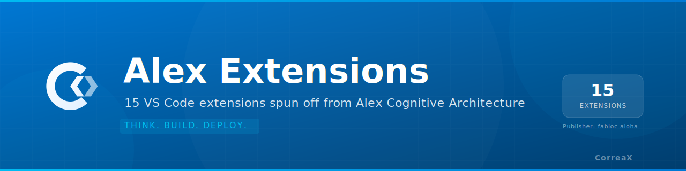

<p align="center">
  
</p>

<p align="center">
  <strong>15 VS Code extensions spun off from Alex Cognitive Architecture</strong><br>
  <sub>Build Status: ✅ All compile | Publisher: <code>fabioc-aloha</code> | VS Code 1.109+</sub>
</p>

---

A family of standalone VS Code extensions spun off from the [Alex Cognitive Architecture](https://github.com/fabioc-aloha/Alex_Plug_In). Each extension is a focused, self-contained utility that works without requiring Alex — but shares patterns, API clients, and design conventions that allow future re-integration.

---

## Extensions

| Extension | Category | Status | Priority |
|---|---|:---:|:---:|
| [Hook Studio](./extensions/hook-studio/) | 🪝 Dev Tools | ✅ Ready to ship | 🔥 P0 |
| [Workspace Watchdog](./extensions/workspace-watchdog/) | 👁️ Awareness | ✅ Ready to ship | 🔥 P0 |
| [MCP App Starter](./extensions/mcp-app-starter/) | 🛠️ Dev Tools | ✅ Ready to ship | 🔥 P0 |
| [SecretGuard](./extensions/secret-guard/) | 🔒 Security | ✅ Implemented | P1 |
| [Focus Timer](./extensions/focus-timer/) | ⏱️ Productivity | ✅ Implemented | P1 |
| [Knowledge Decay Tracker](./extensions/knowledge-decay-tracker/) | 📅 Knowledge | ✅ Implemented | P1 |
| [Markdown to Word](./extensions/markdown-to-word/) | 📄 Converter | ✅ Implemented | P1 |
| [AI Voice Reader](./extensions/ai-voice-reader/) | 🔊 Accessibility | ✅ Implemented | P2 |
| [Brandfetch Logo Fetcher](./extensions/brandfetch-logo-fetcher/) | 🏢 Utility | ✅ Implemented | P2 |
| [Dev Wellbeing](./extensions/dev-wellbeing/) | 🧘 Wellness | ✅ Implemented | P2 |
| [PPTX Builder](./extensions/pptx-builder/) | 📊 Converter | ✅ Implemented | P2 |
| [Replicate Image Studio](./extensions/replicate-image-studio/) | 🎨 Image Gen | ✅ Implemented | P2 |
| [Mermaid Diagram Pro](./extensions/mermaid-diagram-pro/) | 📐 Diagramming | ✅ Implemented | P3 |
| [SVG Toolkit](./extensions/svg-toolkit/) | 🖼️ Image Gen | ✅ Implemented | P3 |
| [Gamma Slide Assistant](./extensions/gamma-slide-assistant/) | 🎤 Presenter | ✅ Implemented | P3 |

---

## Repository Structure

```
Extensions/
├── README.md                   — This file
├── ROADMAP.md                  — Priority, timeline, status per extension
├── TODO.md                     — Current sprint tasks
├── CONTRIBUTING.md             — How to contribute and code standards
├── package.json                — Workspace root (npm workspaces)
├── tsconfig.base.json          — Shared TypeScript configuration
├── .gitignore
├── .github/
│   └── copilot-instructions.md — Alex heir guidance for this repo
├── shared/                     — Shared utilities extracted from Alex
│   ├── index.ts                — Barrel export for all shared code
│   ├── tsconfig.json           — Shared package TypeScript config
│   ├── api/                    — API clients (Replicate, Brandfetch)
│   └── utils/                  — Decay engine, secret scanner, file observations
├── templates/
│   ├── basic-extension/        — Minimal VS Code extension scaffold
│   └── webview-extension/      — Extension with Webview scaffold
└── extensions/
    ├── hook-studio/
    ├── workspace-watchdog/
    ├── mcp-app-starter/
    └── ... (15 total)
```

---

## Getting Started

### Prerequisites
- Node.js 20+
- VS Code 1.109+
- `npm` or `pnpm`

### Install all workspaces
```bash
npm install
```

### Build all extensions
```bash
npm run compile:all
```

### Build a single extension
```bash
cd extensions/hook-studio
npm run compile
```

### Package and test locally
```bash
cd extensions/hook-studio
npx vsce package
code --install-extension hook-studio-*.vsix
```

Reload VS Code window after installation to activate the extension.

---

## Design Principles

1. **Zero Alex dependency** — Every extension works as a standalone install. No dependency on `alex-cognitive-architecture`.
2. **Code extracted, not copied** — Shared logic lives in `shared/` and is imported, not duplicated per extension.
3. **First mover where possible** — Ship before competing extensions exist. Hook Studio and MCP App Starter have an open window right now.
4. **No AI subscription required for core** — AI features are additive, not blocking. SecretGuard, Focus Timer, and Workspace Watchdog work with zero API keys.
5. **Alex synergy preserved** — Settings namespaces, API key storage, and UX patterns stay consistent for possible future re-integration.

---

## Publishing

All extensions publish to the VS Code Marketplace under the `fabioc-aloha` publisher. Each extension has its own `CHANGELOG.md` and version lifecycle.

See [CONTRIBUTING.md](./CONTRIBUTING.md) for the full publish checklist.

---

## Source

These extensions originate from patterns built in the Alex Cognitive Architecture:
- **Alex**: [Alex_Plug_In](https://github.com/fabioc-aloha/Alex_Plug_In)
- **Global Knowledge**: [Alex-Global-Knowledge](https://github.com/fabioc-aloha/Alex-Global-Knowledge)
