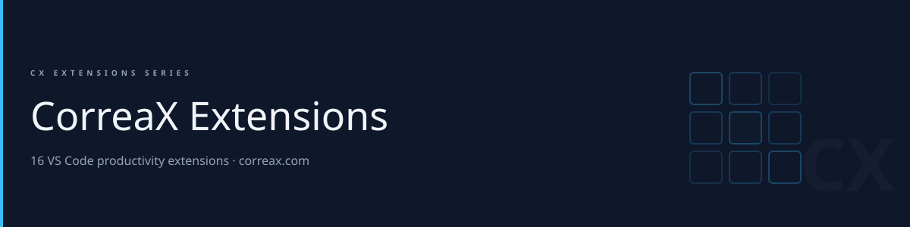

<p align="center">
  
</p>

<p align="center">
  <strong>16 VS Code extensions spun off from Alex Cognitive Architecture</strong><br>
  <sub>9 live on Marketplace | Publisher: <code>fabioc-aloha</code> | VS Code 1.109+</sub>
</p>

---

A family of standalone VS Code extensions spun off from the [Alex Cognitive Architecture](https://github.com/fabioc-aloha/Alex_Plug_In). Each extension is a focused, self-contained utility that works without requiring Alex — but shares patterns, API clients, and design conventions that allow future re-integration.

---

## Extensions

### Sprint 1 — Published ✅

| Extension | Category | Marketplace |
|---|---|---|
| [Hook Studio](./extensions/hook-studio/) | 🪝 Dev Tools | [fabioc-aloha.hook-studio](https://marketplace.visualstudio.com/items?itemName=fabioc-aloha.hook-studio) |
| [CX Workspace Watchdog](./extensions/workspace-watchdog/) | 👁️ Awareness | [fabioc-aloha.cx-workspace-watchdog](https://marketplace.visualstudio.com/items?itemName=fabioc-aloha.cx-workspace-watchdog) |
| [MCP App Starter](./extensions/mcp-app-starter/) | 🛠️ Dev Tools | [fabioc-aloha.mcp-app-starter](https://marketplace.visualstudio.com/items?itemName=fabioc-aloha.mcp-app-starter) |

### Sprint 2 — 4/6 Published ✅

| Extension | Category | Marketplace |
|---|---|---|
| [Knowledge Decay Tracker](./extensions/knowledge-decay-tracker/) | 📅 Knowledge | [fabioc-aloha.knowledge-decay-tracker](https://marketplace.visualstudio.com/items?itemName=fabioc-aloha.knowledge-decay-tracker) |
| [Brandfetch Logo Fetcher](./extensions/brandfetch-logo-fetcher/) | 🏢 Utility | [fabioc-aloha.brandfetch-logo-fetcher](https://marketplace.visualstudio.com/items?itemName=fabioc-aloha.brandfetch-logo-fetcher) |
| [AI Voice Reader](./extensions/ai-voice-reader/) | 🔊 Accessibility | [fabioc-aloha.ai-voice-reader](https://marketplace.visualstudio.com/items?itemName=fabioc-aloha.ai-voice-reader) |
| [CX SecretGuard](./extensions/secret-guard/) | 🔒 Security | [fabioc-aloha.cx-secret-guard](https://marketplace.visualstudio.com/items?itemName=fabioc-aloha.cx-secret-guard) |
| [CX Focus Timer](./extensions/focus-timer/) | ⏱️ Productivity | ⏳ Publish pending (rate limit) |
| [CX Markdown to Word](./extensions/markdown-to-word/) | 📄 Converter | ⏳ Publish pending (rate limit) |

> **Naming note**: `workspace-watchdog`, `secret-guard`, `focus-timer`, and `markdown-to-word` were taken on Marketplace by other publishers — these ship with the `cx-` prefix.

### Sprint 3 — Compile-Ready

| Extension | Category | Status |
|---|---|:---:|
| [Dev Wellbeing](./extensions/dev-wellbeing/) | 🧘 Wellness | 🔧 Next up |
| [PPTX Builder](./extensions/pptx-builder/) | 📊 Converter | 🔧 Next up |
| [Replicate Image Studio](./extensions/replicate-image-studio/) | 🎨 Image Gen | 🔧 Next up |

### Sprint 4 — Compile-Ready

| Extension | Category | Status |
|---|---|:---:|
| [Mermaid Diagram Pro](./extensions/mermaid-diagram-pro/) | 📐 Diagramming | 🔮 Planned |
| [SVG Toolkit](./extensions/svg-toolkit/) | 🖼️ Image Gen | 🔮 Planned |
| [SVG to PNG](./extensions/svg-to-png/) | 🖼️ Image Gen | 🔮 Planned |
| [Gamma Slide Assistant](./extensions/gamma-slide-assistant/) | 🎤 Presenter | 🔮 Planned |

---

## Repository Structure

```
Extensions/
├── README.md                   — This file
├── ROADMAP.md                  — Priority, timeline, status per extension
├── TODO.md                     — Current sprint tasks
├── CONTRIBUTING.md             — How to contribute and code standards
├── package.json                — Workspace root (npm workspaces)
├── tsconfig.base.json          — Shared TypeScript configuration
├── .gitignore
├── .github/
│   └── copilot-instructions.md — Alex heir guidance for this repo
├── shared/                     — Shared utilities extracted from Alex
│   ├── index.ts                — Barrel export for all shared code
│   ├── tsconfig.json           — Shared package TypeScript config
│   ├── api/                    — API clients (Replicate, Brandfetch)
│   └── utils/                  — Decay engine, secret scanner, file observations
├── templates/
│   ├── basic-extension/        — Minimal VS Code extension scaffold
│   └── webview-extension/      — Extension with Webview scaffold
└── extensions/
    ├── hook-studio/
    ├── workspace-watchdog/
    ├── mcp-app-starter/
    └── ... (16 total)
```

---

## Getting Started

### Prerequisites
- Node.js 20+
- VS Code 1.109+
- `npm` or `pnpm`

### Install all workspaces
```bash
npm install
```

### Build all extensions
```bash
npm run compile:all
```

### Build a single extension
```bash
cd extensions/hook-studio
npm run compile
```

### Bundle and test locally
```bash
cd extensions/hook-studio
npm run bundle                              # esbuild → out/extension.js
npx @vscode/vsce package
code --install-extension hook-studio-*.vsix
```

Reload VS Code window after installation to activate the extension.

---

## Branding & UX Standards

All CX extensions follow the **CorreaX Brand Design Kit (DK)** — dark-first, no Azure Blue.

| Standard | Spec | Status |
|----------|------|--------|
| Icon background | `#0f172a` + CX badge + accent bar | ✅ 16 icons |
| Banner | `#0f172a` bg + 4px accent bar + series label | ✅ 16 banners |
| PWA icons | `#0f172a` 72–512px, CX lettermark in sky blue | ✅ 8 sizes |
| Context menu | `$(tools) CX Tools` submenu, semantic groups | ✅ 14 extensions · 2 N/A |
| Palette authority | [DK-correax-brand.md](./DK-correax-brand.md) | ✅ |

### Context Menu Groups

Commands in the `$(tools) CX Tools` submenu are sorted into four semantic groups:

| Group | ID | Purpose |
|-------|-----|---------|
| Analyse | `1_analysis@N` | Scan, preview, validate, view reports |
| Transform | `2_transform@N` | Convert, export, copy, save |
| Generate | `3_generate@N` | Create, scaffold, insert, start |
| Settings | `4_info@N` | API keys, config, docs, history |

Extensions **without** a context menu (workspace-level only): `dev-wellbeing`, `focus-timer`.

---

## Design Principles

1. **Zero Alex dependency** — Every extension works as a standalone install. No dependency on `alex-cognitive-architecture`.
2. **Code extracted, not copied** — Shared logic lives in `shared/` and is bundled inline via esbuild — no runtime dependency on the monorepo.
3. **First mover where possible** — Ship before competing extensions exist. Hook Studio, MCP App Starter, and Workspace Watchdog targeted the VS Code 1.109 launch window.
4. **No AI subscription required for core** — AI features are additive, not blocking. SecretGuard, Focus Timer, and Workspace Watchdog work with zero API keys.
5. **Alex synergy preserved** — Settings namespaces, API key storage, and UX patterns stay consistent for possible future re-integration.

---

## Publishing

All extensions publish to the VS Code Marketplace under the `fabioc-aloha` publisher. Each extension has its own `CHANGELOG.md` and version lifecycle.

See [CONTRIBUTING.md](./CONTRIBUTING.md) for the full publish checklist.

---

## Source

These extensions originate from patterns built in the Alex Cognitive Architecture:
- **Alex**: [Alex_Plug_In](https://github.com/fabioc-aloha/Alex_Plug_In)
- **Global Knowledge**: [Alex-Global-Knowledge](https://github.com/fabioc-aloha/Alex-Global-Knowledge)
