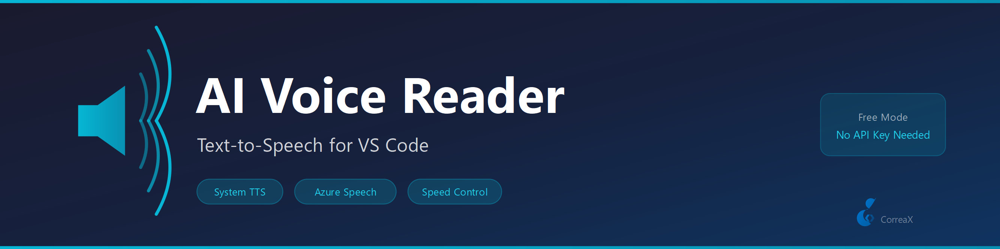

# AI Voice Reader

**Text-to-speech for VS Code — read documents, selections, and notes aloud**

Uses the operating system's built-in TTS engine (no API key required). Automatically strips Markdown syntax before reading so headings and code blocks sound natural.

## Features

- **Read Selection** — read selected text or the current line with one command
- **Read Document** — narrate entire files from start to finish
- **Markdown-aware** — strips `#`, `**`, backticks, and code fences before speaking
- **Cross-platform** — PowerShell TTS on Windows, `say` on macOS, `espeak` on Linux
- **Configurable speed** — adjust playback rate from 0.5× to 2.0×

## Requirements

No external tools required. Uses your operating system's built-in text-to-speech engine.

| OS | Engine | Status |
|---|---|---|
| Windows | `System.Speech.Synthesis` via PowerShell | Pre-installed |
| macOS | `say` command | Pre-installed |
| Linux | `espeak` | `sudo apt install espeak` if missing |
## Commands

| Command | Description |
|---|---|
| `Voice Reader: Read Selection` | Read selected text (or current line) |
| `Voice Reader: Read Entire Document` | Read the whole active file |
| `Voice Reader: Read File...` | Pick any text file to read |
| `Voice Reader: Stop` | Stop playback immediately |

## Platform Support

| OS | Engine |
|---|---|
| Windows | PowerShell `System.Speech.Synthesis.SpeechSynthesizer` |
| macOS | `say` command |
| Linux | `espeak` |

## Settings

| Setting | Default | Description |
|---|---|---|
| `voiceReader.rate` | 1.0 | Speed (0.5–2.0) |
| `voiceReader.stripMarkdown` | true | Remove Markdown before speaking |

## License

MIT
