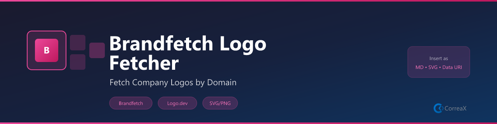

# Brandfetch Logo Fetcher

**Fetch company logos and brand assets by domain — insert as Markdown, SVG URL, or HTML**

Type a domain name, choose your format, and the logo is ready to paste. Powered by Brandfetch API with Logo.dev fallback. LRU cache keeps repeated lookups instant.

## Commands

| Command | Description |
|---|---|
| `Brandfetch: Fetch Logo by Domain` | Fetch and copy to clipboard |
| `Brandfetch: Insert Logo at Cursor` | Insert Markdown image at cursor |
| `Brandfetch: Set API Key` | Store Brandfetch API key (uses VS Code SecretStorage) |
| `Brandfetch: Clear Logo Cache` | Clear in-memory LRU cache |

## Output Formats

- **Markdown Image** — ``
- **SVG URL** — raw URL for SVG logo
- **PNG URL** — raw URL for PNG logo
- **HTML ``** — full img tag

## Source

Shared client: `shared/api/brandfetch.ts`. API key stored via VS Code SecretStorage. License: MIT
