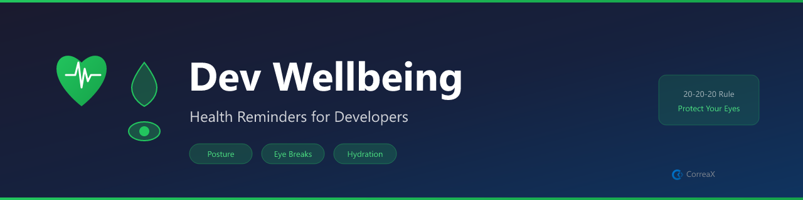

# Dev Wellbeing

**Healthy coding habits — posture reminders, eye breaks, hydration nudges, and session stats**

Runs quietly in the background. Fires gentle reminders at configurable intervals. Tracks session duration and keystrokes.

## Features

- **Posture reminders** — gentle nudges to sit up and unclench shoulders
- **20-20-20 eye breaks** — look 20ft away for 20 seconds every 20 minutes
- **Hydration nudges** — water reminders at a configurable interval
- **Session stats** — coding duration and keystroke count in the status bar
- **Auto-start** — activates on VS Code launch when devWellbeing.enabled is true

## Requirements

No external tools required. Works entirely within VS Code using native notifications.

## Reminders

| Type | Default | Description |
|---|---|---|
| Posture | Every 45m | Sit up, unclench shoulders |
| 20-20-20 eye break | Every 20m | Look 20ft away for 20s |
| Hydration | Every 60m | Have some water |

## Commands

| Command | Description |
|---|---|
| `Dev Wellbeing: Start Monitoring` | Start all reminder timers |
| `Dev Wellbeing: Stop Monitoring` | Stop all reminders |
| `Dev Wellbeing: Show Session Stats` | Duration + keystroke count |
| `Dev Wellbeing: Configure Thresholds` | Open settings |

Auto-starts on VS Code launch if `devWellbeing.enabled` is `true`.

---

## 🔷 CX Tools Suite

Explore more tools from the same suite:

| Extension | Description | Marketplace |
|-----------|-------------|-------------|
| AI Voice Reader | Read files, selections, or documents aloud with Web Speech API | [Install ↗](https://marketplace.visualstudio.com/items?itemName=fabioc-aloha.ai-voice-reader) |
| Brandfetch Logo Fetcher | Fetch and insert brand logos from any domain — SVG, PNG, or Markdown | [Install ↗](https://marketplace.visualstudio.com/items?itemName=fabioc-aloha.brandfetch-logo-fetcher) |
| **Dev Wellbeing** *(this)* | Posture, eye-strain, and hydration reminders for long coding sessions | [Install ↗](https://marketplace.visualstudio.com/items?itemName=fabioc-aloha.dev-wellbeing) |
| Focus Timer | Pomodoro-style focus and break timer with status bar countdown | [Install ↗](https://marketplace.visualstudio.com/items?itemName=fabioc-aloha.cx-focus-timer) |
| Gamma Slide Assistant | Export Marp Markdown presentations to HTML and PDF | [Install ↗](https://marketplace.visualstudio.com/items?itemName=fabioc-aloha.gamma-slide-assistant) |
| Hook Studio | Visual editor for VS Code hook conditions and automation rules | [Install ↗](https://marketplace.visualstudio.com/items?itemName=fabioc-aloha.hook-studio) |
| Knowledge Decay Tracker | Track staleness of documentation and flag overdue reviews | [Install ↗](https://marketplace.visualstudio.com/items?itemName=fabioc-aloha.knowledge-decay-tracker) |
| Markdown to Word | Convert Markdown + Mermaid diagrams to .docx via Pandoc | [Install ↗](https://marketplace.visualstudio.com/items?itemName=fabioc-aloha.cx-markdown-to-word) |
| MCP App Starter | Scaffold Model Context Protocol servers in TypeScript, JavaScript, or Python | [Install ↗](https://marketplace.visualstudio.com/items?itemName=fabioc-aloha.mcp-app-starter) |
| Mermaid Diagram Pro | Preview, export, and validate Mermaid diagrams in Markdown files | [Install ↗](https://marketplace.visualstudio.com/items?itemName=fabioc-aloha.mermaid-diagram-pro) |
| PPTX Builder | Generate PowerPoint presentations from Markdown using pptxgenjs | [Install ↗](https://marketplace.visualstudio.com/items?itemName=fabioc-aloha.pptx-builder) |
| Replicate Image Studio | Generate images and videos with FLUX, SDXL, and WAN via Replicate API | [Install ↗](https://marketplace.visualstudio.com/items?itemName=fabioc-aloha.replicate-image-studio) |
| SecretGuard | Scan workspaces and files for accidentally committed secrets and keys | [Install ↗](https://marketplace.visualstudio.com/items?itemName=fabioc-aloha.cx-secret-guard) |
| SVG to PNG | Convert SVG files to PNG using resvg-js (Rust renderer, no ImageMagick) | [Install ↗](https://marketplace.visualstudio.com/items?itemName=fabioc-aloha.svg-to-png) |
| SVG Toolkit | Preview, copy as data URI, and validate SVG files in-editor | [Install ↗](https://marketplace.visualstudio.com/items?itemName=fabioc-aloha.svg-toolkit) |
| Workspace Watchdog | Monitor file health, detect stalled work, and surface hot files | [Install ↗](https://marketplace.visualstudio.com/items?itemName=fabioc-aloha.cx-workspace-watchdog) |

## License

MIT
