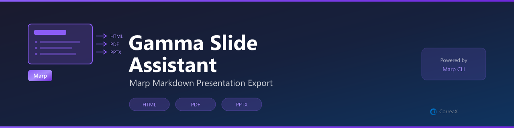

# Gamma Slide Assistant



**Write presentations in Markdown, render with Marp — beautiful slides without leaving VS Code**

[](https://code.visualstudio.com/)

> Note: The Gamma.app API is not publicly available. This extension uses [Marp](https://marp.app/) — the best-in-class offline Markdown presentation engine — as the rendering backend.

Write slides in Markdown using `---` as separators. One command exports to HTML, PDF, or launches a browser preview.

## Usage

1. Run **Gamma Slides: New Presentation** to create a starter deck
2. Write slides using `---` as slide separators
3. Run **Gamma Slides: Export as HTML** or **Gamma Slides: Preview in Browser**

## Requirements

```bash
npm install -g @marp-team/marp-cli
```

## Slide Format

```markdown
---
marp: true
theme: default
paginate: true
---

# Title Slide

---

## Slide 2

Your content here.
```

## Commands

| Command | Description |
|---|---|
| `Gamma Slides: New Presentation` | Create a starter Marp Markdown file |
| `Gamma Slides: Insert Marp Frontmatter` | Add Marp config to existing file |
| `Gamma Slides: Export as HTML` | Render to standalone HTML |
| `Gamma Slides: Export as PDF` | Render to PDF |
| `Gamma Slides: Preview in Browser` | Open rendered slides in browser |

## License

MIT
