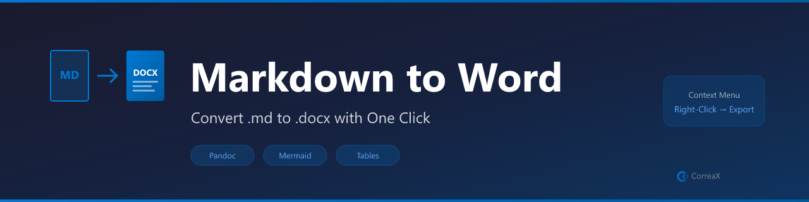

# Markdown to Word

**Convert Markdown + Mermaid diagrams to professional Word (.docx) via Pandoc**

Right-click any `.md` file → **Convert to Word**. Outputs a `.docx` alongside your Markdown file. Supports custom reference docs for house styles.

## Features

- **Right-click convert** — right-click any .md file in the Explorer to convert to Word
- **Mermaid diagram support** — diagrams rendered to PNG and embedded in the .docx
- **Custom house styles** — point to a reference .docx for your company style template
- **Output alongside source** — .docx created next to your Markdown file automatically
- **Pandoc-powered** — industry-standard document conversion quality

## Requirements

- [Pandoc](https://pandoc.org/installing.html) must be installed

## Commands

| Command | Description |
|---|---|
| `Markdown to Word: Convert Current File` | Convert active .md to .docx |
| `Markdown to Word: Convert With Options` | Choose output path |
| `Markdown to Word: Check Pandoc Installation` | Verify pandoc is available |

## Settings

| Setting | Default | Description |
|---|---|---|
| `markdownToWord.pandocPath` | `pandoc` | Path to pandoc |
| `markdownToWord.referenceDoc` | `` | Custom .docx style template |

## License

MIT
