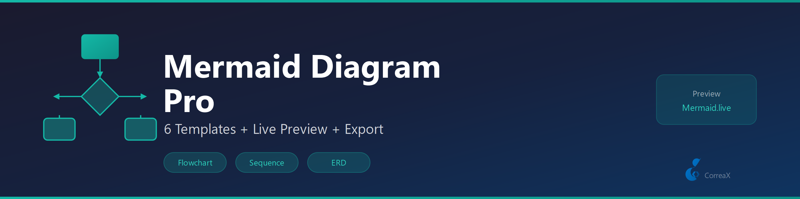

# Mermaid Diagram Pro

**Enhanced Mermaid diagram support — templates, Mermaid Live preview, validation**

6 built-in diagram templates. Quick access to Mermaid Live Editor with your diagram pre-loaded. Validation of all diagram blocks in the active file.

## Features

- **6 diagram templates** — flowchart, sequence, class diagram, git graph, ER, timeline
- **Live preview** — open any diagram in Mermaid Live Editor pre-loaded with your code
- **Inline validation** — count and list all mermaid code blocks in the active file
- **SVG export guidance** — instructions for mmdc CLI export
- **Works in .md and .mmd files**

## Requirements

No external tools required for templates, preview, and validation. For local SVG export only: npm install -g @mermaid-js/mermaid-cli

## Diagram Templates

- `flowchart` — Decision flow
- `sequence` — Sequence diagram
- `classDiagram` — OOP class hierarchy
- `gitGraph` — Git branch visualization
- `erDiagram` — Entity relationship
- `timeline` — Project timeline

## Commands

| Command | Description |
|---|---|
| `Mermaid Pro: Insert Diagram Template` | Insert a starter diagram |
| `Mermaid Pro: Preview Diagram at Cursor` | Open in Mermaid Live Editor |
| `Mermaid Pro: Export as SVG` | Instructions for mmdc CLI export |
| `Mermaid Pro: Validate All Diagrams in File` | Count and list all diagram blocks |

---

## 🔷 CX Tools Suite

Explore more tools from the same suite:

| Extension | Description | Marketplace |
|-----------|-------------|-------------|
| AI Voice Reader | Read files, selections, or documents aloud with Web Speech API | [Install ↗](https://marketplace.visualstudio.com/items?itemName=fabioc-aloha.ai-voice-reader) |
| Brandfetch Logo Fetcher | Fetch and insert brand logos from any domain — SVG, PNG, or Markdown | [Install ↗](https://marketplace.visualstudio.com/items?itemName=fabioc-aloha.brandfetch-logo-fetcher) |
| Dev Wellbeing | Posture, eye-strain, and hydration reminders for long coding sessions | [Install ↗](https://marketplace.visualstudio.com/items?itemName=fabioc-aloha.dev-wellbeing) |
| Focus Timer | Pomodoro-style focus and break timer with status bar countdown | [Install ↗](https://marketplace.visualstudio.com/items?itemName=fabioc-aloha.cx-focus-timer) |
| Gamma Slide Assistant | Export Marp Markdown presentations to HTML and PDF | [Install ↗](https://marketplace.visualstudio.com/items?itemName=fabioc-aloha.gamma-slide-assistant) |
| Hook Studio | Visual editor for VS Code hook conditions and automation rules | [Install ↗](https://marketplace.visualstudio.com/items?itemName=fabioc-aloha.hook-studio) |
| Knowledge Decay Tracker | Track staleness of documentation and flag overdue reviews | [Install ↗](https://marketplace.visualstudio.com/items?itemName=fabioc-aloha.knowledge-decay-tracker) |
| Markdown to Word | Convert Markdown + Mermaid diagrams to .docx via Pandoc | [Install ↗](https://marketplace.visualstudio.com/items?itemName=fabioc-aloha.cx-markdown-to-word) |
| MCP App Starter | Scaffold Model Context Protocol servers in TypeScript, JavaScript, or Python | [Install ↗](https://marketplace.visualstudio.com/items?itemName=fabioc-aloha.mcp-app-starter) |
| **Mermaid Diagram Pro** *(this)* | Preview, export, and validate Mermaid diagrams in Markdown files | [Install ↗](https://marketplace.visualstudio.com/items?itemName=fabioc-aloha.mermaid-diagram-pro) |
| PPTX Builder | Generate PowerPoint presentations from Markdown using pptxgenjs | [Install ↗](https://marketplace.visualstudio.com/items?itemName=fabioc-aloha.pptx-builder) |
| Replicate Image Studio | Generate images and videos with FLUX, SDXL, and WAN via Replicate API | [Install ↗](https://marketplace.visualstudio.com/items?itemName=fabioc-aloha.replicate-image-studio) |
| SecretGuard | Scan workspaces and files for accidentally committed secrets and keys | [Install ↗](https://marketplace.visualstudio.com/items?itemName=fabioc-aloha.cx-secret-guard) |
| SVG to PNG | Convert SVG files to PNG using resvg-js (Rust renderer, no ImageMagick) | [Install ↗](https://marketplace.visualstudio.com/items?itemName=fabioc-aloha.svg-to-png) |
| SVG Toolkit | Preview, copy as data URI, and validate SVG files in-editor | [Install ↗](https://marketplace.visualstudio.com/items?itemName=fabioc-aloha.svg-toolkit) |
| Workspace Watchdog | Monitor file health, detect stalled work, and surface hot files | [Install ↗](https://marketplace.visualstudio.com/items?itemName=fabioc-aloha.cx-workspace-watchdog) |

## License

MIT
