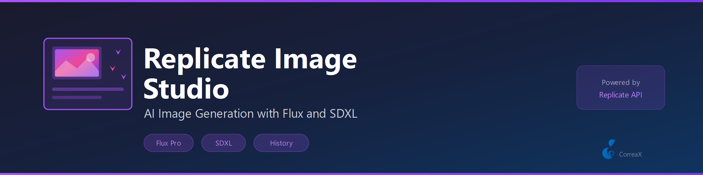

# Replicate Image Studio

**Generate images inside VS Code using Flux, SDXL, WAN 2.1 — insert results as Markdown**

Type a prompt, choose a model, get an image URL — then insert as a Markdown image with one click. Session history tracks all your generations.

## Features

- **Multi-model generation** — Flux Schnell, Flux Dev, SDXL, and WAN 2.1 video
- **Insert as Markdown** — generated image URLs inserted at cursor with one click
- **Session history** — all generations tracked for the current VS Code session
- **Secure key storage** — API key in VS Code SecretStorage, never in settings.json
- **Prompt from selection** — selected text pre-fills the generation prompt

## Requirements

A [Replicate API key](https://replicate.com/account/api-tokens) is required. Set it via the Replicate: Set API Key command.

## Models

| Model | Speed | Quality |
|---|---|---|
| Flux Schnell | Fast | Good |
| Flux Dev | Slow | Excellent |
| SDXL | Medium | Great |
| WAN 2.1 | Slow | Video |

## Commands

| Command | Description |
|---|---|
| `Replicate: Generate Image` | Prompt → image → copy Markdown |
| `Replicate: Generate Video (WAN)` | Prompt → video URL |
| `Replicate: Set API Key` | Store key via VS Code SecretStorage |
| `Replicate: View Generation History` | Show session log |
| `Replicate: Insert Last Image as Markdown` | Insert at cursor |

## Source

Shared client: `shared/api/replicate.ts`. API key in SecretStorage. License: MIT
