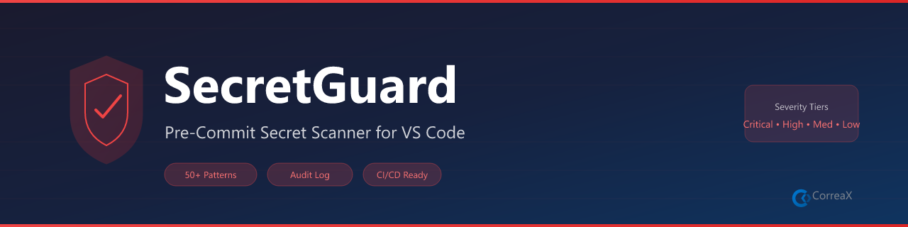

# SecretGuard

**Pre-commit secret scanner — catch leaked API keys, tokens, and credentials before they leave your machine**

Scans files for 13+ secret patterns including OpenAI, GitHub, AWS, Azure, Replicate API keys, private keys, passwords, and connection strings. Shows findings in the Problems panel with severity levels.

## Features

- **Scan on Save** — automatic scan every time a file is saved
- **Workspace Scan** — full sweep on demand
- **Problems Panel** — findings appear as errors/warnings with line numbers
- **Ignore Patterns** — glob-based exclusions for test files, fixtures, etc.

## Requirements

No external tools required. The scanner engine runs entirely within VS Code.

## Commands

| Command | Description |
|---|---|
| `SecretGuard: Scan Workspace` | Scan all workspace files |
| `SecretGuard: Scan Current File` | Scan the active editor |
| `SecretGuard: View Audit Report` | Show output channel log |
| `SecretGuard: Add Ignore Pattern` | Exclude a glob pattern |

## Source

Shared scanner engine: `shared/utils/secretScanner.ts` (extracted from Alex Cognitive Architecture v5.8.4).

## License

MIT
