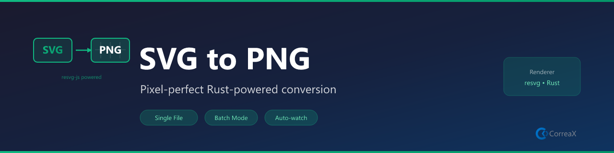

# SVG to PNG

**Convert SVG files to pixel-perfect PNGs — Rust-based rendering, batch convert, right-click workflow**

Right-click any `.svg` in the Explorer → **SVG to PNG: Convert SVG File**. Uses [resvg-js](https://github.com/yisibl/resvg-js), a Rust-based renderer that produces accurate, anti-aliased PNGs with full system font support — no ImageMagick, no Inkscape, nothing to install.

## Features

- **Right-click convert** — Explorer context menu on any `.svg` file for instant conversion
- **Custom width** — scale output to any pixel width while preserving aspect ratio
- **Batch convert** — convert every SVG in the workspace with one command
- **Accurate rendering** — Rust/resvg engine handles gradients, paths, and text correctly
- **System fonts** — text in SVGs renders using your installed system fonts
- **Auto-open** — converted PNG opens immediately in VS Code preview

## Requirements

No installation required. The `@resvg/resvg-js` Rust renderer is **bundled with the extension** — no system dependencies, no ImageMagick, no Inkscape needed.

## Usage

### Single File

Right-click any `.svg` file in the Explorer → **SVG to PNG: Convert SVG File**

### Custom Width

Right-click → **SVG to PNG: Convert SVG at Custom Width** → enter pixel width

### Batch

Command Palette (`Ctrl+Shift+P`) → **SVG to PNG: Convert All SVGs in Workspace**

## Commands

| Command | Description |
|---|---|
| `SVG to PNG: Convert SVG File` | Convert the selected SVG to PNG |
| `SVG to PNG: Convert SVG at Custom Width` | Convert at a custom pixel width |
| `SVG to PNG: Convert All SVGs in Workspace` | Batch convert all SVGs in the workspace |

## Settings

| Setting | Default | Description |
|---|---|---|
| `svgToPng.defaultWidth` | `0` | Output width in px (0 = natural SVG size) |
| `svgToPng.loadSystemFonts` | `true` | Load system fonts for text rendering |
| `svgToPng.openAfterConvert` | `true` | Open PNG in preview after conversion |

## Why resvg?

ImageMagick's SVG parser is incomplete and often mangles gradients, paths, and text. resvg-js uses a Rust implementation of the full SVG spec — the same rendering quality as modern browsers, with no lossy interpretation.

## License

MIT
