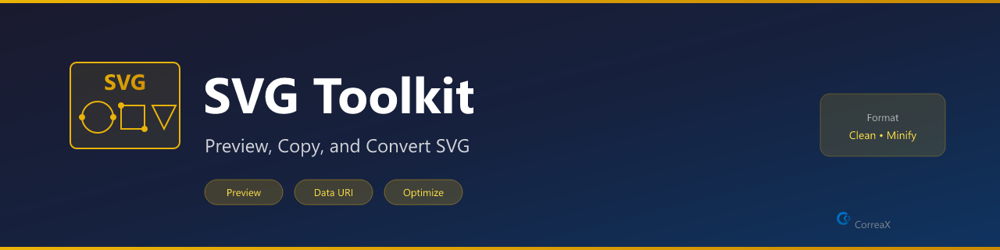

# SVG Toolkit

**SVG utilities — inline preview, data URI copy, icon templates, and basic validation**

Right-click any `.svg` file in the Explorer for quick actions. Or use commands from the Command Palette.

## Features

- **Inline SVG preview** — render any SVG in a VS Code side panel instantly
- **Data URI copy** — copy data:image/svg+xml;base64,... for use in CSS or HTML
- **Markdown image copy** — paste directly as an inline Markdown image
- **Icon templates** — insert circle, checkmark, arrow, or star starter SVG
- **Validation** — check for required svg, viewBox, and xmlns attributes
- **Right-click context menu** — Explorer right-click for Preview and Copy actions

## Requirements

No external tools required. Works entirely within VS Code.

## Commands

| Command | Description |
|---|---|
| `SVG Toolkit: Preview SVG` | Render SVG in a side panel |
| `SVG Toolkit: Copy as Data URI` | Copy `data:image/svg+xml;base64,...` |
| `SVG Toolkit: Copy as Markdown Image` | Copy as inline Markdown image |
| `SVG Toolkit: Insert Icon Template` | Insert circle, checkmark, arrow, or star template |
| `SVG Toolkit: Validate SVG` | Check for `<svg>`, `viewBox`, `xmlns` |

## Context Menu

Right-click `.svg` files in Explorer for **Preview SVG** and **Copy as Data URI**.

## License

MIT
